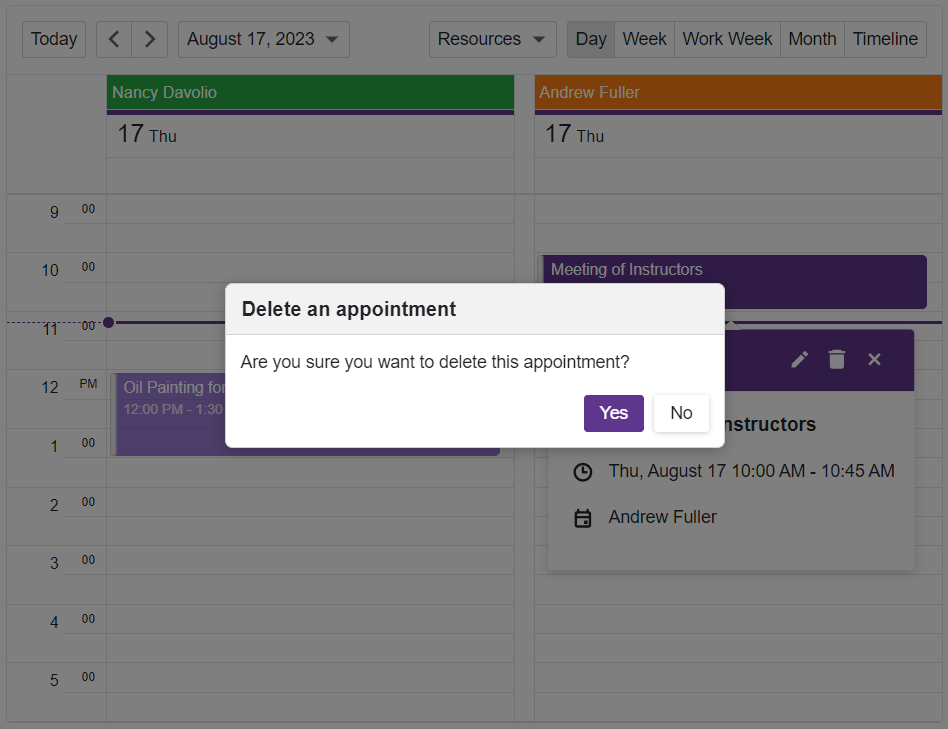

<!-- default badges list -->

<!-- default badges end -->
# Popup for Blazor - How to implement a confirmation dialog

This example demonstrates how to use DevExpress [Blazor Popup](https://docs.devexpress.com/Blazor/404363/components/dialogs-and-windows#popup) to create a [custom confirmation dialog](https://docs.devexpress.com/Blazor/404497/components/dialogs-and-windows/popup-based-confirmation-dialog) for delete operations in DevExpress [Blazor Scheduler](https://docs.devexpress.com/Blazor/401179/components/scheduler).

## Overview

Follow the steps below to implement a confirmation dialog:

1. Add a [DxPopup](https://docs.devexpress.com/Blazor/DevExpress.Blazor.DxPopup) component to the page, disable default user actions that dismiss the popup, and add custom buttons to the component's content area.

2. Handle the [DxSxheduler](https://docs.devexpress.com/Blazor/DevExpress.Blazor.DxScheduler) component's [AppointmentRemoving](https://docs.devexpress.com/Blazor/DevExpress.Blazor.DxScheduler.AppointmentRemoving) event to display a confirmation dialog when a user attempts to delete an appointment.

3. Create a [task](https://learn.microsoft.com/en-us/dotnet/api/system.threading.tasks.taskcompletionsource-1?view=net-7.0) that displays the confirmation form. Handle button clicks to store user choice - confirm or cancel. The scheduler's event reads the user choice and cancels deletion if necessary. 

## Files to Review

- [ConfirmationDialog.razor](CS/Pages/ConfirmationDialog.razor)
- [Index.razor](CS/Pages/Index.razor)

## Documentation

- [Implement a Confirmation Dialog Based on Blazor Popup](https://docs.devexpress.com/Blazor/404363/components/dialogs-and-windows/popup-based-confirmation-dialog)
- [DxScheduler - Manage Appointments](https://docs.devexpress.com/Blazor/404770/components/scheduler/appointments#manage-appointments)

## More Examples

- [Grid for Blazor - Create a custom record deletion confirmation dialog](https://github.com/DevExpress-Examples/blazor-dxgrid-show-custom-confirmation-dialog)
