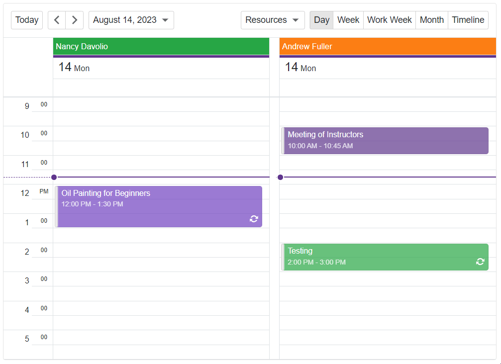

# Popup for Blazor - How to implement a confirmation dialog

This example demonstrates how to use the [DxPopup](https://docs.devexpress.com/Blazor/DevExpress.Blazor.DxPopup) component to create a confirmation dialog for delete operations in DxScheduler.



## Overview

Follow the steps below to implement a confirmation dialog:

1. Add the [DxPopup](https://docs.devexpress.com/Blazor/DevExpress.Blazor.DxPopup) component to the page and disable the default [close actions](CS/./Pages/ConfirmationDialog.razor#L4).

2. Specify the component's [BodyContentTemplate](https://docs.devexpress.com/Blazor/DevExpress.Blazor.DxPopupBase.BodyContentTemplate) property and add two [custom confirmation buttons](CS/Pages/ConfirmationDialog.razor#L11) to the template.

3. To display a confirmation dialog when a user deletes an appointment, handle the [DxSxheduler](https://docs.devexpress.com/Blazor/DevExpress.Blazor.DxScheduler) component's [AppointmentRemoving](https://docs.devexpress.com/Blazor/DevExpress.Blazor.DxScheduler.AppointmentRemoving) event. In the handler, asynchroniously call the **ConfirmOperation** method.

    ```razor
    @code {
        // ...
        async Task OnAppointmentRemoving(SchedulerAppointmentOperationEventArgs args) {
        args.Cancel = !(await confDialog.ConfirmOperation("Delete an appointment",
            "Are you sure you want to delete this appointment?"));
    }
        // ...
    }
    ```

    The **ConfirmOperation** method uses a [TaskCompletionSource<TResult>](https://learn.microsoft.com/en-us/dotnet/api/system.threading.tasks.taskcompletionsource-1?view=net-7.0) object to create a task that is explicitly controlled by *TaskCompletionSource* methods.

    ```razor
    @code {
        bool ConfirmationShown { get; set; } = false;
        string HeaderText { get; set; } = string.Empty;
        string BodyText { get; set; } = string.Empty;
        TaskCompletionSource<bool> tcs;

        public Task<bool> ConfirmOperation(string headerText, string bodyText) {
            HeaderText = headerText;
            BodyText = bodyText;
            ConfirmationShown = true;
            InvokeAsync(StateHasChanged);

            tcs = new TaskCompletionSource<bool>();
            tcs.Task.ContinueWith(_ => {
                ConfirmationShown = false;
            });
            return tcs.Task;
        }
        // ...
    }
    ```

4. On a custom button click, call the [SetResult](https://learn.microsoft.com/en-us/dotnet/api/system.threading.tasks.taskcompletionsource-1.setresult?view=net-7.0#system-threading-tasks-taskcompletionsource-1-setresult(-0)) method and pass the corresponding resulting value to the task. Based on the result, DxScheduler deletes the appointment or cancels the delete operation.

    ```razor
    @code {
        // ...
        private void YesClick() {
            tcs.SetResult(true);
        }
        private void NoClick() {
            tcs.SetResult(false);
        }
        public void Dispose() {
            tcs = null;
        }
    }
    ```

## Files to Review

- [ConfirmationDialog.razor](CS/Pages/ConfirmationDialog.razor)
- [Index.razor](CS/Pages/Index.razor)

## Documentation

- [DxPopup - Show and Close a Popup](https://docs.devexpress.com/Blazor/DevExpress.Blazor.DxPopup#show-and-close-a-popup)
- [DxScheduler - Manage Appointments](https://docs.devexpress.com/Blazor/DevExpress.Blazor.DxScheduler?#manage-appointments)
