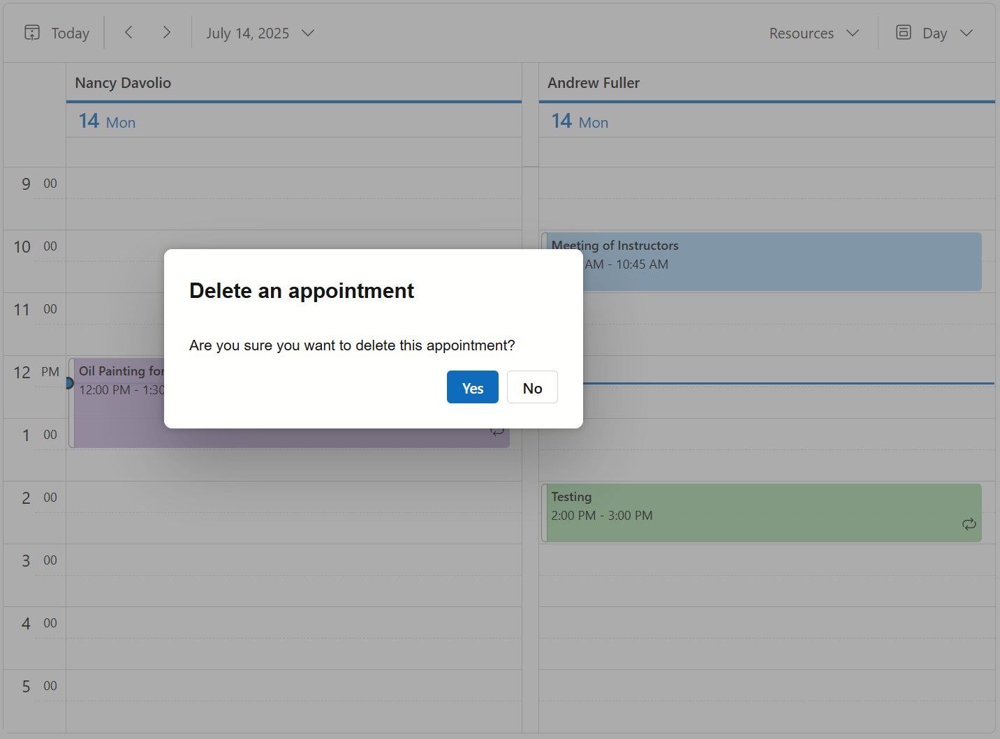

<!-- default badges list -->

[](https://supportcenter.devexpress.com/ticket/details/T1183417)
[](https://docs.devexpress.com/GeneralInformation/403183)
[](#does-this-example-address-your-development-requirementsobjectives)
<!-- default badges end -->
# Popup for Blazor - How to implement a confirmation dialog

This example demonstrates how to use DevExpress [Blazor Popup](https://docs.devexpress.com/Blazor/404363/components/dialogs-and-windows#popup) to create a [custom confirmation dialog](https://docs.devexpress.com/Blazor/404497/components/dialogs-and-windows/popup-based-confirmation-dialog) for delete operations in DevExpress [Blazor Scheduler](https://docs.devexpress.com/Blazor/401179/components/scheduler).



## Overview

Follow the steps below to implement a confirmation dialog:

1. Creare a confirmation dialog component (`ConfirmationDialog`). Populate it with a [DxPopup](https://docs.devexpress.com/Blazor/DevExpress.Blazor.DxPopup) component, disable default user actions that dismiss the popup, and add custom buttons to the component's content area.

    ```html
    <DxPopup @bind-Visible="@ConfirmationShown" 
             HeaderText="@HeaderText"
             HeaderCssClass="confirmation-dialog-header"
             ShowCloseButton="false" 
             CloseOnOutsideClick="false" 
             CloseOnEscape="false" 
             Width="400px">
        <BodyContentTemplate>
            <p>@BodyText</p>
            <div class="confirmation-dialog-content">
                <DxButton Text="Yes" Click="YesClick" RenderStyle="ButtonRenderStyle.Primary"></DxButton>
                <DxButton Text="No" Click="NoClick" RenderStyle="ButtonRenderStyle.Secondary"></DxButton>
            </div>
        </BodyContentTemplate>
    </DxPopup>  
    ```

2. Handle the [DxSсheduler](https://docs.devexpress.com/Blazor/DevExpress.Blazor.DxScheduler) component's [AppointmentRemoving](https://docs.devexpress.com/Blazor/DevExpress.Blazor.DxScheduler.AppointmentRemoving) event to display a confirmation dialog when a user attempts to delete an appointment.

    ```html
    <DxScheduler AppointmentRemoving="OnAppointmentRemoving" ...
    
    @code {
        ConfirmationDialog confDialog;
        async Task OnAppointmentRemoving(SchedulerAppointmentOperationEventArgs args) {
            args.Cancel = !(await confDialog.ConfirmOperation("Delete an appointment",
                "Are you sure you want to delete this appointment?"));
        }
    }
    ```

3. Create a [task](https://learn.microsoft.com/en-us/dotnet/api/system.threading.tasks.taskcompletionsource-1?view=net-7.0) that displays the confirmation form. Handle button clicks to store user choice - confirm or cancel. The scheduler's event reads the user choice and cancels deletion if necessary.

    ```cs
    bool ConfirmationShown { get; set; } = false;
    string HeaderText { get; set; } = string.Empty;
    string BodyText { get; set; } = string.Empty;
    TaskCompletionSource<bool> tcs;
    
    public Task<bool> ConfirmOperation(string headerText, string bodyText) {
        HeaderText = headerText;
        BodyText = bodyText;
        ConfirmationShown = true;
        InvokeAsync(StateHasChanged);
    
        tcs = new TaskCompletionSource<bool>();
        tcs.Task.ContinueWith(_ => {
            ConfirmationShown = false;
        });
        return tcs.Task;
    }
    private void YesClick() {
        tcs.SetResult(true);
    }
    private void NoClick() {
        tcs.SetResult(false);
    }
    public void Dispose() {
        tcs = null;
    }
    ```

## Files to Review

- [ConfirmationDialog.razor](CS/Components/Pages/ConfirmationDialog.razor)
- [Index.razor](CS/Components/Pages/Index.razor)

## Documentation

- [DxScheduler - Manage Appointments](https://docs.devexpress.com/Blazor/404770/components/scheduler/appointments#manage-appointments)
- [Confirmation Dialog Based on DevExpress Blazor Message Box](https://docs.devexpress.com/Blazor/404497/components/dialogs-and-windows/confirmation-dialog)

## More Examples

- [Grid for Blazor - Create a custom record deletion confirmation dialog](https://github.com/DevExpress-Examples/blazor-dxgrid-show-custom-confirmation-dialog)
<!-- feedback -->
## Does this example address your development requirements/objectives?

[](https://www.devexpress.com/support/examples/survey.xml?utm_source=github&utm_campaign=blazor-popup-confirmation-dialog&~~~was_helpful=yes) [](https://www.devexpress.com/support/examples/survey.xml?utm_source=github&utm_campaign=blazor-popup-confirmation-dialog&~~~was_helpful=no)

(you will be redirected to DevExpress.com to submit your response)
<!-- feedback end -->
